<!--
_class: lead
_paginate: false
_footer: ""
-->

<style>
footer {
    display: table
}
.hljs-variable { color: lightblue }
.hljs-string { color: lightgreen }
.hljs-params { color: lightpink }
</style>

# ML: страх и ненависть в продакшне

### Паша Финкельштейн, JetBrains
### Михаил Марюфич, OK.ru

---

# О себе

- 14 лет в IT
- 11 в разработке с разных концов
- 2 года в DE
- Из них год в [Big Data Tools](https://plugins.jetbrains.com/plugin/12494-big-data-tools) *


*_Big Data Tools — инструмент для упрощения жизни дата инженеров_

---

# Михаил Марюфич


 - Закончил Мат-Мех СПбГУ и Computer Science Center

- Machine Learning Engineer в OK.ru

- Делаю МЛ штуки и внедряю их в продакшен

- Увлекаюсь воспроизводимостью

 

 

 
---

<!-- _class: lead -->

# Это доклад о том, что такое MLOps, зачем он нужен и как можно попробовать его делать

Концепции общие, инструменты меняются

---
# <!-- fit --> О древнейшей истории

- Буча началась с гиганта
- И гигантом был Google

https://papers.nips.cc/paper/5656-hidden-technical-debt-in-machine-learning-systems.pdf


---


---

<!-- 
_backgroundImage: "linear-gradient(to bottom, #000 0%, #1a2028 50%, #000 100%)"
 -->
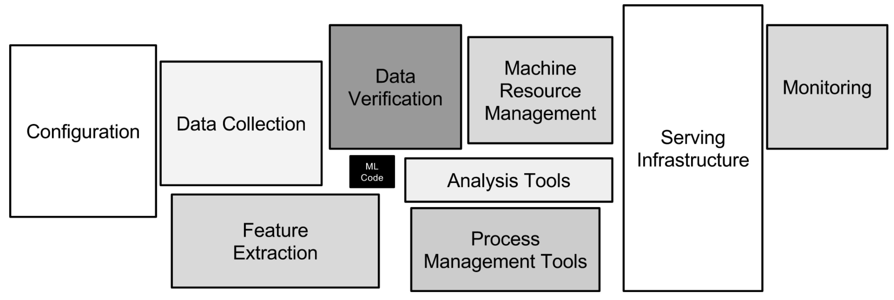


---
<style scoped>
p:nth-child(2) {
    text-align: right
}
</style>
<!-- _class: lead -->
> # Мы все неправы!

_**Google**_

Потому что не продуктивизируем свой ML код.

---

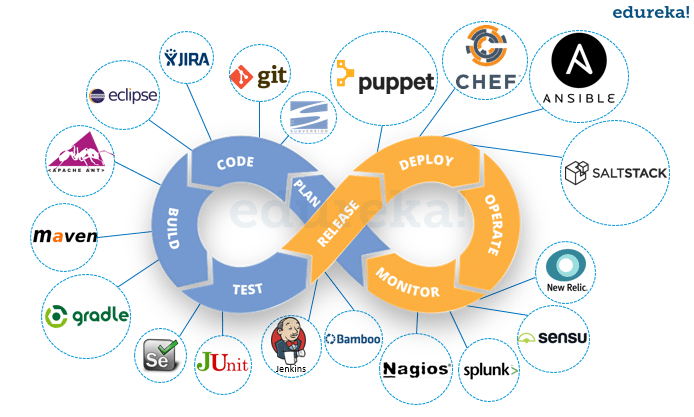

---

# DevOps для обычной разработки

Тем временем в обычной разработке
- Инструментов тонна
- Все знают, как продуктизировать разработку
- Все понимают, где светлое будущее

И конечно же вокруг этого навёрнута тонна практик

---
<!-- _class: lead -->


> DevOps isn’t about tools, but about how teams work together
## Новая книга про анти-паттерны Ops и решения DevOps

---
<!-- _class: lead -->

### <!-- fit --> Так что, MLOps — это просто DevOps?

# **Нет!**

---


---

<!-- _class: lead -->
# MLOps — это ещё одна ступень специализации

---

# Как устроен ML


---


# А кто такие дата саентисты?

- Data — данные, тут всё понятно.
  - копаются в реке и находят золото
- Scientists — учёные. Экспериментаторы

---
Роли в ML разработке

<!-- 
_backgroundImage: "linear-gradient(to bottom, #000 0%, #1a2028 50%, #000 100%)"
 -->

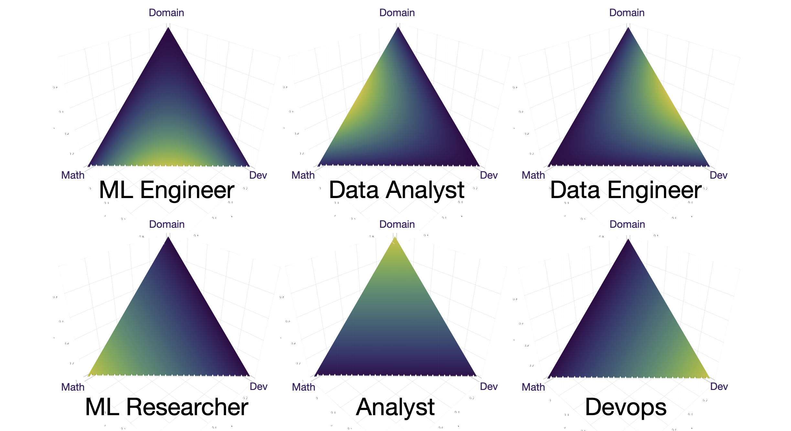

---


# Требования к эксперименту

- Формулирование гипотезы
- Описание специфических условий
- Воспроизводимость
- Протоколирование

---

<!-- _class: lead -->

<style scoped>
p:nth-child(2) {
    text-align: right
}
</style>


> MLOps — это это способ сделать эксперименты научным, а не наколеночным


Эйнштейн

---
<style scoped>
p:nth-child(2) {
    text-align: right
}
</style>

# Я всегда верю цитатам в интернете


Курт Кобейн

---
# Как устроен ML


---
###  ML workflow
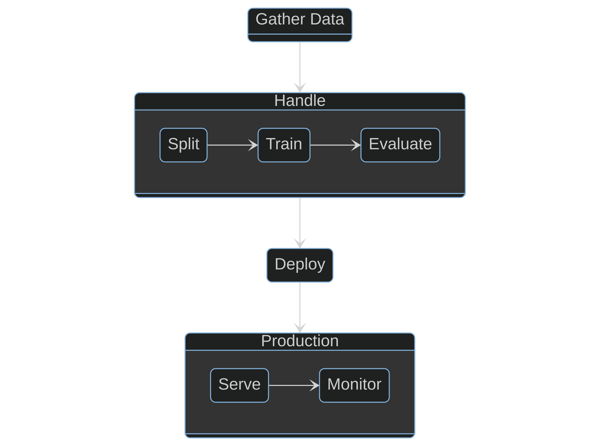

---
## А чем ПРИНЦИПИАЛЬНО отличается от DEVOPS?


---
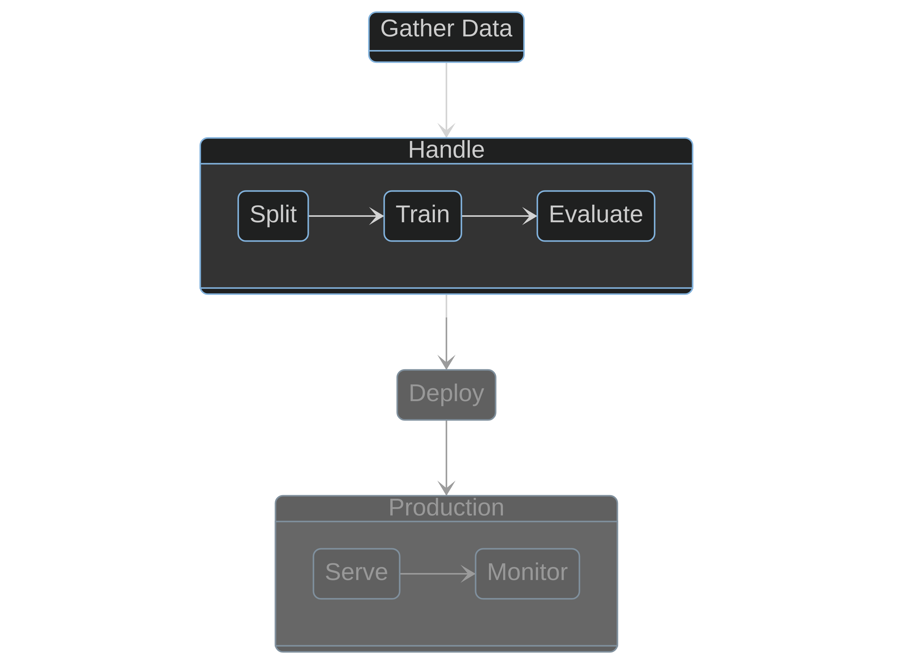

---
### Это же билд!


---
### Это же билд!


<br/>
<br/>
<br/>
<br/>
<br/>
<br/>
PS: только очень сложный

--- 
# Что тут пошло не так?

- Всё одним куском
- Протокола эксперимента нет
- Информации об исходных данных нет
- Результаты меняются от запуска к запуску

---

<!-- 
_class: invert 
_color: #000000
-->

# Что делать?


---
<!-- _class: lead -->
# <!-- fit --> Разве это не очевидно?
# НЕТ!

---

<!-- _color: black -->

# Jupyter


---

# Jupyter

- Самый популярный (и достаточно удобный) инструмент Data Scientist'а
- Код вперемешку с Markdown
- Написан и исполняется в непредсказуемом порядке


---
<!-- _class: lead -->
# <!-- fit --> Придётся переучивать

---


---

# DVC

- Создавался специально в пару к гиту
- Изначально был похож на LFS (git-lfs)
- Оброс функциональностью

---

# Примеры

```bash
git add
dvc add
```

Добавить какой-то файл под контроль git/dvc

---

# Примеры
```bash
git commit
dvc commit
```

Сохранить состояние файла

---

# Примеры
```bash
git diff
dvc diff
```

Посмотреть разницу с каким-то состоянием

---


---
<!-- _class: lead -->
# <!-- fit --> The talk is cheap

## Show us the demo!


---

# Ок, но это консоль

- Молодёжь :older_man: не любит терминалы
- Этим неудобно пользоваться при командной разработке
- Тимлиду может быть неудобно работать с метриками


---
<!-- _color: black -->

# PR - это очень удобно

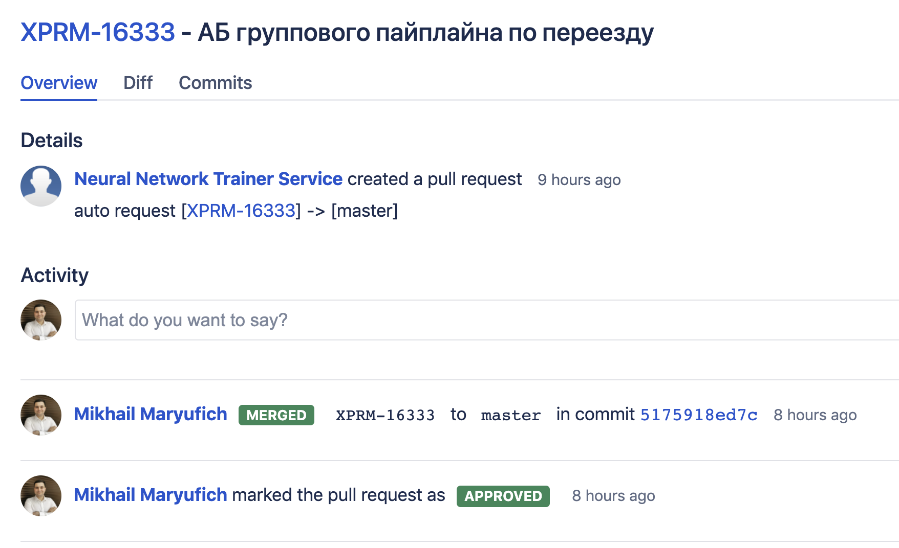

---


---

# Easy

```python
mlflow.sklearn.autolog()
remote_server_uri = "http://127.0.0.1:5000"
mlflow.set_tracking_uri(remote_server_uri)
mlflow.set_experiment("udemy-courses")
```

---

## MLFlow Tracking 

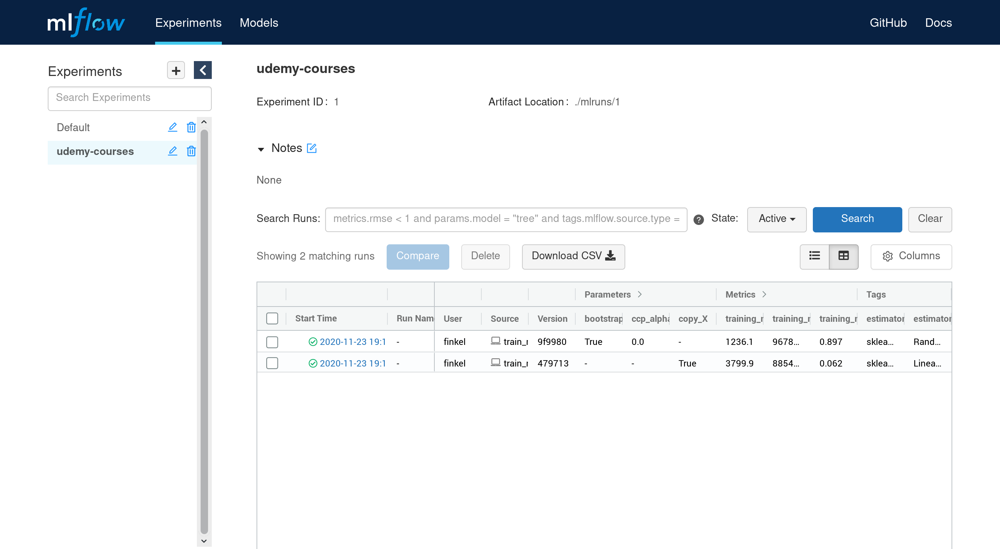

---

##  MLFlow Tracking  - сравнение запусков

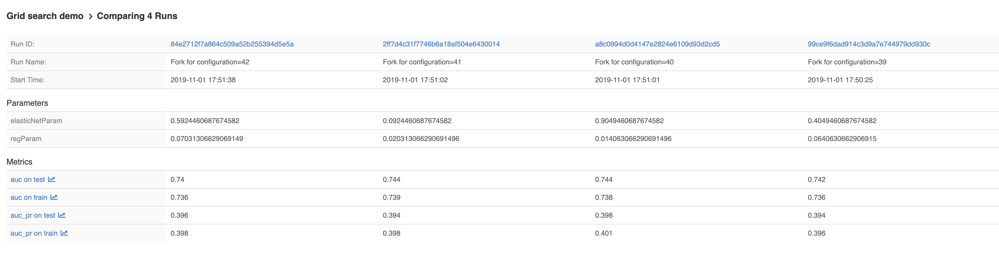

---
##  MLFlow Tracking  - сравнение запусков

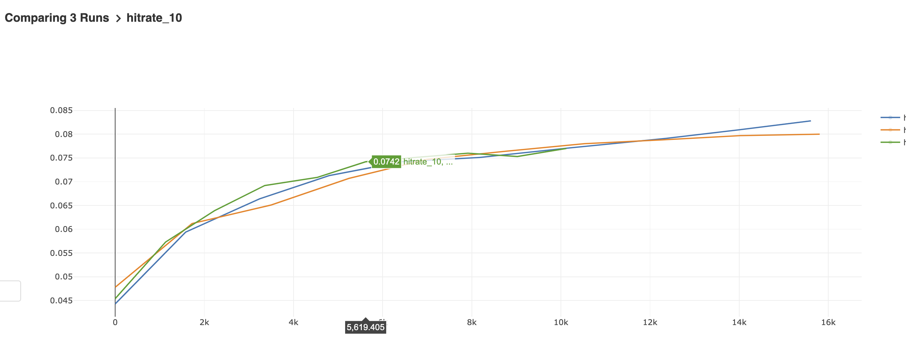

---

### MLFLOW MODEL REGISTRY


---


# Как модель там окажется?


---

# Как модель там окажется?

```python
from mlflow.tracking import MlflowClient

client = MlflowClient()
client.create_registered_model("sk-learn-random-forest-reg-model")
```

```python
client = MlflowClient()
result = client.create_model_version(
    name="sk-learn-random-forest-reg-model",
    source="mlruns/0/d16076a3ec534311817565e6527539c0/artifacts/sklearn-model",
    run_id="d16076a3ec534311817565e6527539c0"
)
```

---
# Что дальше?

- У нас есть модельки
- У нас есть каталог моделек
- Тестируем!

---

# Тестируем

Мы уже знаем всё, что надо знать про модельки:

1. Среднеквадратичное отклонение
2. Коэффициент детерминации
3. Метрики, специфичные для нашей модели

Всё это можно делать в целом в любом CI!

---
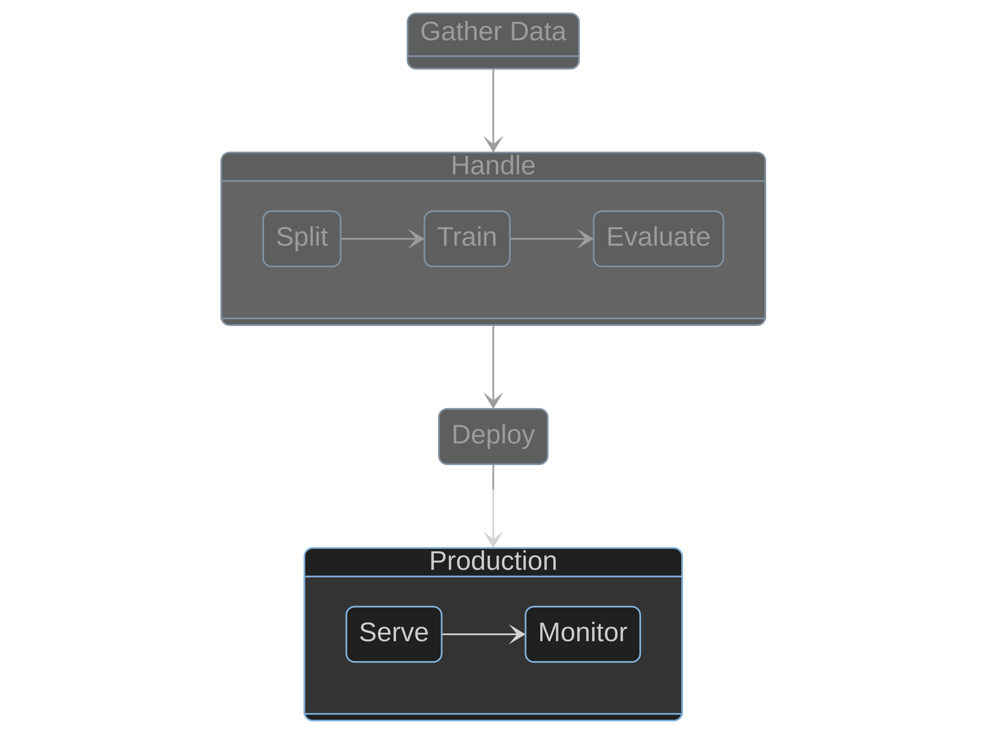

---


# Serve 
* Есть ML MODEL - это бинарник (.pkl, .pth, .h5)
* Нужно делать к ней запросы

---

# Serve 
- Есть ML MODEL - это бинарник (.pkl, .pth, .h5)
- Нужно делать к ней запросы
- И каждый стремится написать свой велосипед =( 

--- 

# MLFLOW SERVING

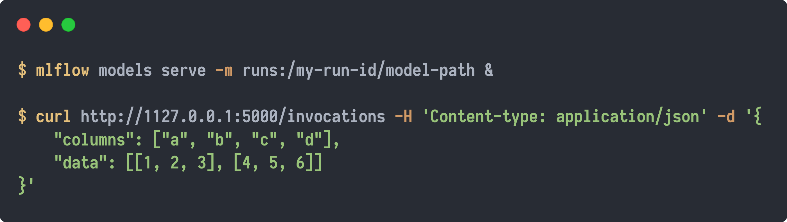

--- 


---

## Show us the demo!


--- 

# Мониторинг

2 типа инструментов:
1. ML-Специфичные
2. Общие

---

# MLWatcher


- range, mean, std, median, q25, q50, q75, iqr for any continuous values (probabilities, features)
- count, frequency for any discrete values (labels, classes)

Python-агент, который позволяет мониторить *статистические* метрики

Sampling

---

# Пример


Метрики улетают когда цвета внезапно инвертируются

---

# Использование

1. Уложить MLWatcher рядом со своим приложением :scream:
2. Поднять сервер
3. Начать с определённой частотой репортить метрики на сервер

---

# Общие метрики

Мониторить параметры модели - мало

Надо мониторить
1. Системный метрики
1.1. la
1.2. free
1.3. latency…
2. Бизнес-метрики модели (например потерянные клиенты)

---

# Инструменты

- Prometheus
- Grafana
- Zabbix etc


---


---

<!-- _class: lead -->
# Мониторинг — важнейшая часть продуктивизированного ML

Без него не имеет смысла вообще продуктивизировать — будет непредсказуемо

---

# Чему мы научились

1. MLOps — это процессы и командное взаимодействие
2. Чтобы построить MLOps надо иметь базовый набор инструментов
3. Кроме стандартных инструментов есть и непривычные: DVC, MLFlow
4. Продуктивизация ML — это большой путь, который надо пройти

---
<!-- 
_class: lead 
_footer: ""
-->
# <!-- fit --> QA

Паша Финкельштейн: if (:bird:) @asm0di0 else @asm0dey
Михаил Марюфич: @mikhailmar
